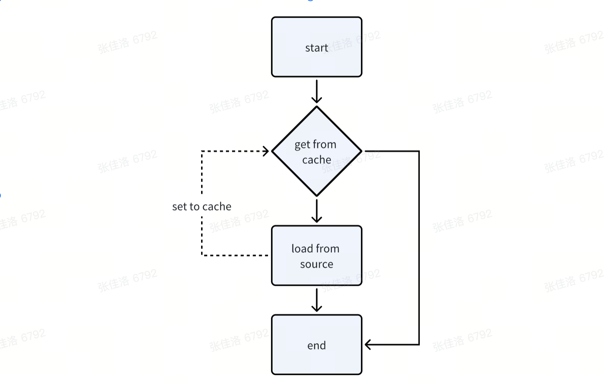
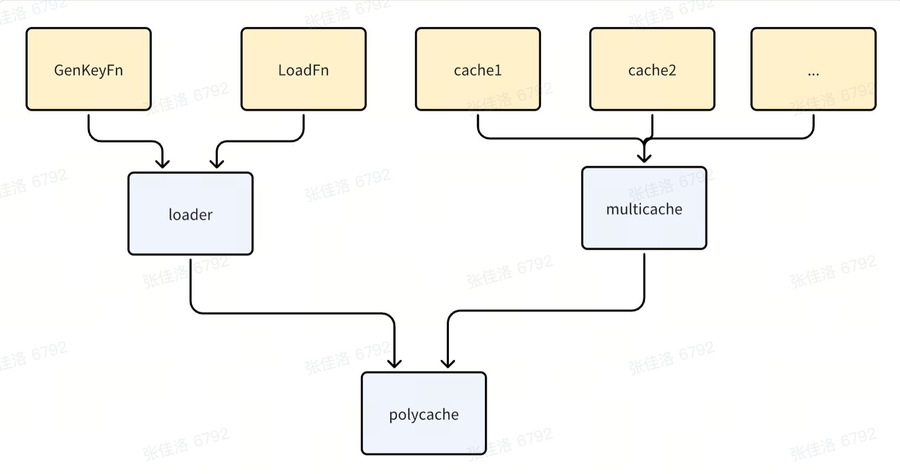

# PolyCache
## Introduction
polycache is a component that get data from different data source「mysql、es、rpc、http...」 and set it to different cache components「localcache、redis...」. Using polycache can eliminate the need to repeatedly develop the logic of fetching data from the data source and setting the results to the cache. Just need to create a ploycache client to solve these repetitive logic.
## Install
```
go get github.com/javacode123/polycache
```
## Usage
``` go
import (
	"context"
	"encoding/json"
	"fmt"
	"testing"
	"time"

	"github.com/alicebob/miniredis/v2"
	"github.com/javacode123/polycache"
	"github.com/javacode123/polycache/cache/gocache"
	rediscache "github.com/javacode123/polycache/cache/redis"
	"github.com/javacode123/polycache/pclog"
	"github.com/redis/go-redis/v9"
)

type User struct {
	ID   int64  `json:"id"`
	Name string `json:"name"`
}

func (u User) MarshalBinary() (data []byte, err error) {
	return json.Marshal(u)
}

func TestGetWithLocalCache(t *testing.T) {
	// config your cache component
	cleanupInterval := time.Minute
	localCache := gocache.NewCache[User](cleanupInterval)
	// Singleton, It's safe for concurrent use by multiple goroutines.
	pc := polycache.NewPolyCache[int64, User](
		// key func, generate key from your req
		func(ctx context.Context, notHitItem int64) string {
			return fmt.Sprintf("id_%d", notHitItem)
		},
		// load source func: where the value from and you need cache the result
		func(ctx context.Context, notHitItem int64) (User, error) {
			return User{
				ID:   notHitItem,
				Name: "user_name",
			}, nil
		},
		// custom settings
		polycache.GetDefaultOption().WithDuration(time.Hour).WithLogeLevel(pclog.LevelDebug),
		localCache,
	)
	ctx := context.Background()
	// fist time to call Get method, it will use singleflight call load source func, and set KV to cache
	res, err := pc.Get(ctx, 1)
	if err != nil {
		panic(err)
	}
	fmt.Printf("get user: %+v \n", res)

	// second time to call Get method, will get from localcache
	res, err = pc.Get(ctx, 1)
	if err != nil {
		panic(err)
	}
	fmt.Printf("get user: %+v \n", res)

	// use dynamicOptions
	res, err = pc.Get(ctx, 2, polycache.WithSourceStrategy(polycache.SsSourceFirst))
	fmt.Printf("get user: %+v \n", res)

}

func TestGetWithMultiLevelCache(t *testing.T) {
	// redis cli
	redisCli := redis.NewClient(&redis.Options{Addr: miniredis.RunT(t).Addr()})
	cleanupInterval := time.Hour
	// first level cache is localcache, second level cache is redis
	fistLevelCache, secondLevelCache := gocache.NewCache[User](cleanupInterval), rediscache.NewCache[User](redisCli)
	pc := polycache.NewPolyCache[int64, User](
		// key func
		func(ctx context.Context, notHitItem int64) string {
			return fmt.Sprintf("id_%d", notHitItem)
		},
		// load source func: where the value from and you need cache the result
		func(ctx context.Context, notHitItem int64) (User, error) {
			return User{
				ID:   notHitItem,
				Name: "user_name",
			}, nil
		},
		// settings, durationStep used to calculate the duration. multiLevelCache[i]'duration = math.pow(expireTimeStep,i) * duration. Prevent multiLevelCache expiring simultaneously.
		polycache.GetDefaultOption().WithDuration(time.Hour).WithLogeLevel(pclog.LevelDebug).WithDurationStep(1.5),
		// multiLevelCache
		fistLevelCache, secondLevelCache,
	)
	ctx := context.Background()
	// fist time to call Get method, it will use singleflight call load source func, and set KV to localcahe and redis
	res, err := pc.Get(ctx, 1)
	if err != nil {
		panic(err)
	}
	fmt.Printf("get user: %+v \n", res)

	// second time to call Get method, will get from localcache
	res, err = pc.Get(ctx, 1)
	if err != nil {
		panic(err)
	}
	fmt.Printf("get user: %+v \n", res)
}
```

## Workflow
``` go
here is simple workflow, and you can custom your option:
type option struct {
    NameSpace          string // Different PolyCache will store value by key which start with NameSpace
    SourceStrategy     sourceStrategy
    Duration           time.Duration // Entry can be evicted after time.Duration
    ReturnWhenCacheErr ReturnWhenCacheErr
    LogLevel           pclog.Level
    DurationStep       float64 // When use multiLevel cache, cache[level]'duration = time.Duration(float64(duration) * math.Pow(w.durationStep, float64(level)))
}
```
<div style="text-align: center;"></div>


## Architecture
<div style="text-align: center;"></div>

- GenKeyFn: build cache Key by input item
- LoadFn: build you load data logic, you can load data from mysql、http、es、rpc...
- cache: actual cache component where your data storage in. Currently implement by redis and gocache. If you want to use other component, you can implement cache.Cache interface.
- loader: wrapper GenKeyFn and LoadFn
- multicache: wrapper cache component to process multiLevel cache logic

## TODO
- add batch method, need to add new interface with MGet、MSet、MDel、MRefresh
- add package bigcaheredis implement cache.Cache which wrap redisCli and split big key 
- add package freecache implement cache.Cache
- support config option async set cache
- add metrics to stat hit rate, get cost and other metrics
- support to stat hotkey and auto refresh
